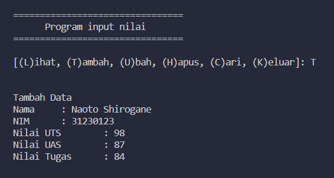

Nama : Alif Nur Fathlii Amarta

NIM : 312210326

Kelas : TI 22 A3

# Praktikum 6

## Latihan 

Dictionary adalah Koleksi item yang berasosiasi dimana setiap pasangan terdiri _key_ dan _value_.

_Key_ dan _Value_ sebagai 'Key' : 'Value'

Dictionary ditulis dengan dipisahkan koma dalam ```{}```

```
telepon = {'Ari' : '081267888', 'Dina' : '087677776'}
```

untuk menampilkan kontak 
```
print(telepon['Ari'])
```

---

Untuk menambahkan elemen dictionary 

```
telepon['Riko']
```

---

untuk mengubah dictionary hampir sama dengan menambahkannya

```
telepon['Dina'] = '088999776'
```

---

Untuk menampilkan semua nama/key nya menggunakan perintah

```
print(telepon.keys())
```

Output nya akan menghasilkan


---

Untuk menampilkan semua nomor telepon/value

```
print(telepon.values())
```

Output nya akan menghasilkan 


---

Untuk menampilkan daftar Nama dan Nomor nya gunakan perintah ```for```

```
for nama,nomor in telepon.items():
    print("%s \t| %s " % (nama,nomor))
```

Output nya akan menghasilkan


---

Hapus kontak Dina menggunakan

``` 
del telepon['Dina']
```

Maka kontak Dina akan terhapus


---

## Tugas Praktikum

Buat dictionary kosong
```
mahasiswa = {}
```
- Buat program untuk lihat data nya

```
def show():
    if mahasiswa.items():
        print("Daftar Nilai")
        print("=================================================================================")
        print("| No |      Nama      |     NIM     |  Tugas  |   UTS   |   UAS   |    Akhir    |")
        print("=================================================================================")
        i = 0
        for a in mahasiswa.items():
            i += 1
            print("| {no:2d} | {0:14s} | {1:11s} | {2:7d} | {3:7d} | {4:7d} |      {5:6.2f} |"
            .format (a[0][: 14],a[1][0],a[1][1],a[1][2],a[1][3],a[1][4], no = i))
        print("=================================================================================")
        
    else:
        print("Daftar Nilai")
        print("=================================================================================")
        print("| No |      Nama      |     NIM     |  Tugas  |   UTS   |   UAS   |    Akhir    |")
        print("=================================================================================")
        print("|                                TIDAK ADA DATA                                 |")
        print("=================================================================================")
```

```else``` digunakan untuk menampilkan yang terjadi jika Nama yang diketik tidak ada

- Buat program untuk Tambah Data nya

```
def add():
    print("Tambah Data")
    nama = input("Nama\t : ")
    nim = input("NIM\t : ")
    uts = int(input("Nilai UTS\t : "))
    uas = int(input("Nilai UAS\t : "))
    tugas = int(input("Nilai Tugas\t : "))
    akhir = (tugas * 30/100) + (uts * 35/100) + (uas * 35/100)
    mahasiswa[nama] = nim, tugas, uts, uas, akhir
```

- Buat program untuk Hapus data

``` 
def delete():
    print("Hapus Data")
    nama = input("Masukkan Nama : ")
    
    if nama in mahasiswa.keys():
        del mahasiswa[nama]
    
    else:
        print("Nama tidak ditemukan")
```

- Buat program untuk Ubah data 

```
def update():
    print("Ubah Data")
    nama = input("Masukkan Nama : ")
    if nama in mahasiswa.keys():
        nim = input("NIM\t : ")
        uts = int(input("Nilai UTS\t : "))
        uas = int(input("Nilai UAS\t : "))
        tugas = int(input("Nilai Tugas\t : "))
        akhir = (tugas * 30/100) + (uts * 35/100) + (uas * 35/100)
        mahasiswa[nama] = nim, tugas, uts, uas, akhir

    else:
        print("Nama tidak ditemukan ")
```

- Buat program untuk Cari data

```
def search():
    print("Cari Data")
    a = input("Masukkan Nama : ")
    if a in mahasiswa.keys():
        print("===========================================================================")
        print("|      Nama      |     NIM     |  Tugas  |   UTS   |   UAS   |    Akhir   |")
        print("===========================================================================")
        print("| {0:14s} | {1:11s} | {2:7d} | {3:7d} | {4:7d} |     {5:6.2f} |"
            .format (a , mahasiswa[a][0], mahasiswa[a][1], mahasiswa[a][2], mahasiswa[a][3], mahasiswa[a][4] ))
        print("===========================================================================")

    else:
        print("=================================================================================")
        print("| No |      Nama      |     NIM     |  Tugas  |   UTS   |   UAS   |    Akhir    |")
        print("=================================================================================")
        print("|                          DATA TIDAK DITEMUKAN                                 |")
        print("=================================================================================")
```
program ini berbeda dengan melihat data, program ini akan memunculkan nama yang diketik pada input


- Buat program untuk menu nya

``` 
def menu():
    print("\n")
    print("================================")
    print("      Program input nilai       ")
    print("================================\n")

    x = input("[(L)ihat, (T)ambah, (U)bah, (H)apus, (C)ari, (K)eluar]: ")
    print("\n")

    if x == 'L':
        show()
    elif x == 'T':
        add()
    elif x == 'U':
        update()
    elif x == 'H':
        delete()
    elif x == 'C':
        search()
    elif x == 'K':
        print("==========================================================================")
        print('\n')
        print("> You exit the code                        ")
        print("\n")
        print("==========================================================================")

        exit()

    else:
        print("            KODE YANG ANDA MASUKKAN TIDAK VALID !!!!!!!!!!!")
```

Program berisikan menu, jika ketik L/T/U/H/C/K maka akan menjalankan perintah program program yang diketik di atas seperti ```show()```, ```add()```, ```update()```, ```delete()```, ```search()```

- Kode nya akan berjalan dengan perintah
``` 
while True:
    menu()
```
---
#### Output nya akan menghasilkan:

- Lihat tanpa data


- Tambah Data



- Lihat dengan data


- Ubah Data


data akan terubah setelah menginputnya


- Hapus Data 


data akan terhapus


- Cari Data


- Keluar


- Flowchart

